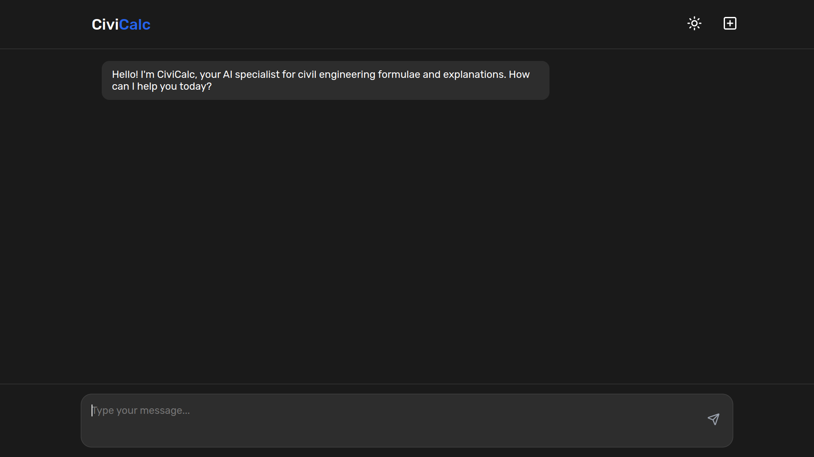
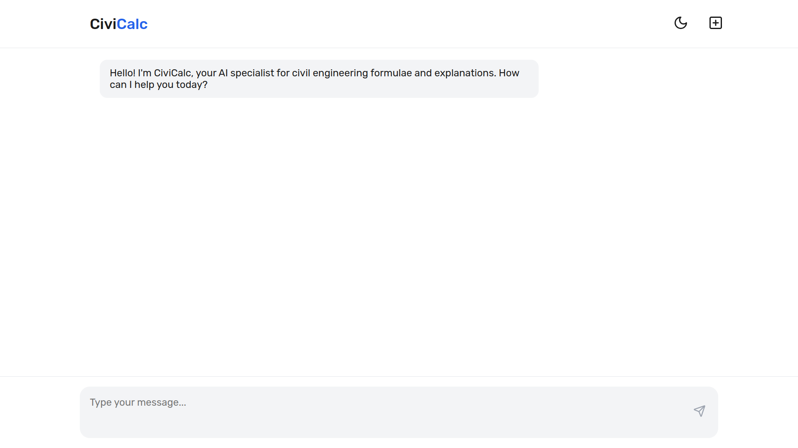
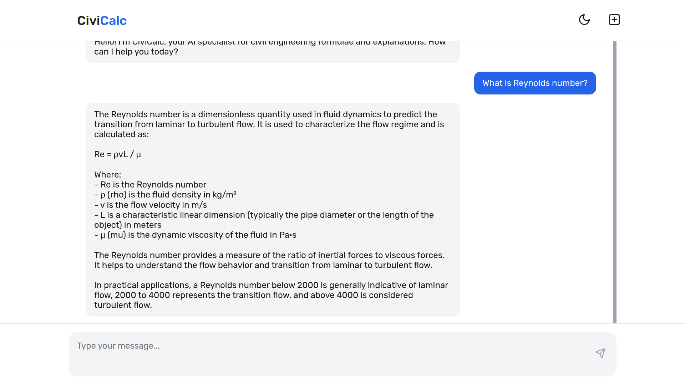
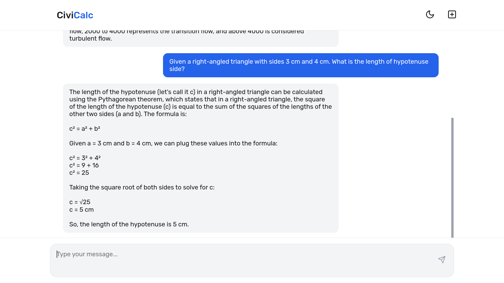

# CiviCalc - Civil Engineering Formula & Calculation Chatbot

**CiviCalc** is a chatbot that provides civil engineering formulae, explanations, and performs complex calculations. It serves as a quick reference and calculation tool for students and professionals in civil engineering.

## Features

- Retrieve civil engineering formulae and explanations.
- Perform complex engineering calculations.
- Real-time AI responses for instant feedback.
- Modern, aesthetic UI with dark-light mode toggle.
- Automated prerequisites installer and launcher scripts.
- Cross-platform support with scripts for Linux, MacOS and Windows.

## Prerequisites

- **Python**
- **Node.js**

## Usage

1. **Clone the repository**:
   ```
   git clone https://github.com/chaitanya-p23/CiviCalc.git
   cd CiviCalc
   ```

2. **For Linux/macOS**:
   ```
   chmod +x ./run.sh
   ./run.sh
   ```

3. **For Windows**:
   ```
   ./run.bat
   ```
   Or directly click on `run.bat` inside the folder to start the application.

Once started, it will automatically open `http://localhost:3000` in your browser to use CiviCalc.

## Screenshots









## Contributing

Contributions are welcome! If you have suggestions for improvements, please fork the repository and create a pull request.
